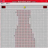
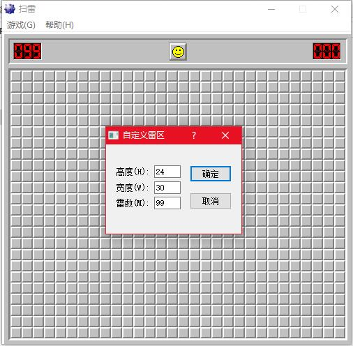
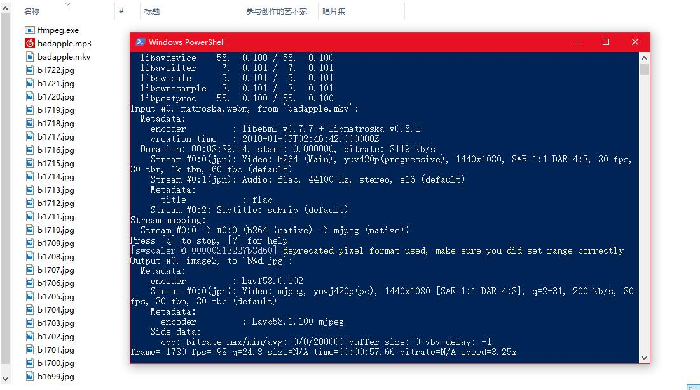

BadApple已经被播放在各种地方，用扫雷实现一次。


<!--more-->

## 快速开始
### 第一步

首先我们知道视频是一帧一帧的播放的，我们就需要先把badapple视频提取成一帧一帧的图片。方法有很多，我推荐用`ffmepg`来实现。下载构建好的windows版本的[ffmepg](https://ffmpeg.zeranoe.com/builds/)。下载完成后有三个exe文件。我们只需要用到ffmepg.exe这个。然后再下载badapple的视频(链接: <https://pan.baidu.com/s/1qXXo0C8> 密码: buvr)。都准备好后，把ffmepg.exe和badapple.mkv这两个文件放到同一个文件夹中。

我们把扫雷的格子弄到最大，大小是24*30。所以我们等等生成的图片的分辨率也应该为24*30。每个像素点对应扫雷上面的一个旗子。


在文件夹空白处按住Shitf键再按鼠标右键选择打开命令行或者powershell。
然后输入`ffmpeg -i badapple.mkv -s 30X24 b%d.jpg`回车


***
### 第二步
我们知道badapple是黑白的视频，但是它并不是有纯黑色or白色构成的。我们就要取出每一张图片的每一个像素的rgb值，然后计算出灰度值。应为扫雷只有有旗子和无旗子两种状态。所以我们要将灰度值平均分两份。超过中间值就插旗子。这样就可以实现图片的效果。我们打开vs2017新建一个控制台应用程序。引用`System.Darwing`。首先我们先定义一个计算灰度值并返回插旗子或者不插旗子的方法。
``` java
private bool IsFlag(int r, int g, int b)//一个像素点的RGB数据
        {
            int gray = (r + g + b) / 3;//计算灰度值
            if (gray > 127)
            {
                return false;
            }
            else
            {
                return true;
            }

        }
```

接着我们按顺序循环读取文件夹里面的每一张图片，并且计算出每张图片的灰度判断是否要插旗子。

``` java
        static void Main(string[] args)
        {
            string path = "D:\\badapple\\b";//文件夹的路径
            int count = 1;//第几张图片
            while (count < 6751)//总共6750张图片，我们就循环6750次
            {
                Bitmap bitmap = new Bitmap(path + count + ".jpg");//读入第count张图片

                for (int y = 0; y < 24; y++)//循环判断每个像素点是否要插旗子
                {
                    for (int x = 0; x < 30; x++)
                    {
                        Color color = bitmap.GetPixel(x, y);
                        if (IsFlag(color.R, color.G, color.B))
                        {
                            //有旗子
                        }
                        else
                        {
                            //无旗子
                        }
                    }
                }
                count++;

            }
        }
```

接着，我们要定义一个数组，来记录整个扫雷是否有插旗子。创建一个24*30的二维数组来记录。true代表有旗子，false代表无旗子：
``` java
stati bool[,] flaginfo = new bool[24,30];
```

我们再定义一个鼠标右键点击的方法(使用`windwosAPI`):
``` java
   [System.Runtime.InteropServices.DllImport("user32")]
        private static extern int mouse_event(int dwFlags, int dx, int dy, int cButtons, int dwExtraInfo);
        //移动鼠标 
        const int MOUSEEVENTF_MOVE = 0x0001;
        //模拟鼠标右键按下 
        const int MOUSEEVENTF_RIGHTDOWN = 0x0008;
        //模拟鼠标右键抬起 
        const int MOUSEEVENTF_RIGHTUP = 0x0010;
        //标示是否采用绝对坐标 
        const int MOUSEEVENTF_ABSOLUTE = 0x8000;
        private static void MouseRightDown(int x, int y, int count)//要点击的坐标和次数
        {
            for (int i = 0; i < count; i++)
            {
                mouse_event(MOUSEEVENTF_ABSOLUTE | MOUSEEVENTF_MOVE | MOUSEEVENTF_RIGHTDOWN | MOUSEEVENTF_RIGHTUP, x * 65536 / 1920, y * 65536 / 1080, 0, 0);
            }
        }
```
我们还要获取扫雷窗口的位置(窗口左上角的坐标),等会调用
``` java
        public struct RECT //定义一个结构接收坐标
        {
            public uint left;
            public uint top;
            public uint Right;
            public uint Bottom;
        }
        [DllImport("User32.dll ")]
        private static extern int FindWindow(string lpClassName, string lpWindowName);//寻找

        [DllImport("user32.dll")]
        private static extern int GetWindowRect(IntPtr hwnd, out RECT lpRect);
```
在main方法中加入
``` java
string fullPath = "扫雷";
int WINDOW_HANDLER = FindWindow(null, fullPath);
RECT r = new RECT();
GetWindowRect((IntPtr)WINDOW_HANDLER, out r);
Point spoint = new Point((int)r.left + 22, (int)r.top + 110); //扫雷第一个方块的坐标
MouseRightDown((int)spoint.X, (int)spoint.Y, 1);//切换到扫雷窗口
```
然后我们就可以更新界面了:
```c#
 private static void Upflaginfo(int x,int y,bool info)//更新界面
        {
            if (flaginfo[x, y] == false)
            {
                if (info == true)
                {
                    MouseRightDown((int)spoint.X + x + x * 15, (int)spoint.Y + y + y * 15, 1);//插旗子
                }
            }
            else
            {
                if (info == false)
                {
                    MouseRightDown((int)spoint.X  + x + x * 15, (int)spoint.Y  + y + y * 15, 2);//取消旗子
                }
            }
            flaginfo[x, y] = info;
        }
```
把这个方法在有无旗帜的地方调用就可以。

现在我们已经可以实现动画在扫雷上面播放了，但是还有一个问题，动画播放的速度不是固定的，如果配上背景音乐的化肯定会不同步。我们从一开始就计时，通过30帧的帧率，就可以算出来当前需要显示的图片。
***
### 最后
所有代码:
``` java
using System;
using System.Collections.Generic;
using System.Linq;
using System.Text;
using System.Threading.Tasks;
using System.Drawing;
using System.IO;
using System.Runtime.InteropServices;

namespace saolei
{
    class Program
    {
        static bool[,] flaginfo = new bool[30, 24]; //创建保存旗帜信息的数组
        static Point spoint;
        static void Main(string[] args)
        {
            Console.WriteLine("请打开扫雷!");
            Console.ReadKey();

            string fullPath = "扫雷";
            int WINDOW_HANDLER = FindWindow(null, fullPath);
            RECT r = new RECT();
            GetWindowRect((IntPtr)WINDOW_HANDLER, out r);
            spoint = new Point((int)r.left + 22, (int)r.top + 110); //扫雷第一个方块的坐标
            MouseRightDown((int)spoint.X, (int)spoint.Y, 1);//切换到扫雷窗口
            string path = "D:\\badapple\\b";//文件夹的路径


            int count = 1;//第几张图片

            DateTime timeBegin = DateTime.Now;
            
            while (count < 6751)//总共6750张图片，我们就循环6750次
            {
                Bitmap bitmap = new Bitmap(path + count + ".jpg");//读入第count张图片

                for (int y = 0; y < 24; y++)//循环判断每个像素点是否要插旗子
                {
                    for (int x = 0; x < 30; x++)
                    {
                        Color color = bitmap.GetPixel(x, y);
                        if (IsFlag(color.R, color.G, color.B))
                        {
                            //有旗子
                            Upflaginfo(x, y, true);
                        }
                        else
                        {
                            //无旗子
                            Upflaginfo(x, y, false);
                        }

                    }
                }
                count = (int)((((DateTime.Now - timeBegin).TotalSeconds) * 30) + 1);
                Console.WriteLine(count);

            }
        }

        public struct RECT //定义一个结构接收坐标
        {
            public uint left;
            public uint top;
            public uint Right;
            public uint Bottom;
        }
        [DllImport("User32.dll ")]
        private static extern int FindWindow(string lpClassName, string lpWindowName);//寻找

        [DllImport("user32.dll")]
        private static extern int GetWindowRect(IntPtr hwnd, out RECT lpRect);

        [System.Runtime.InteropServices.DllImport("user32")]
        private static extern int mouse_event(int dwFlags, int dx, int dy, int cButtons, int dwExtraInfo);
        //移动鼠标 
        const int MOUSEEVENTF_MOVE = 0x0001;
        //模拟鼠标右键按下 
        const int MOUSEEVENTF_RIGHTDOWN = 0x0008;
        //模拟鼠标右键抬起 
        const int MOUSEEVENTF_RIGHTUP = 0x0010;
        //标示是否采用绝对坐标 
        const int MOUSEEVENTF_ABSOLUTE = 0x8000;
        private static void MouseRightDown(int x, int y, int count)//要点击的坐标和次数
        {
            for (int i = 0; i < count; i++)
            {
                mouse_event(MOUSEEVENTF_ABSOLUTE | MOUSEEVENTF_MOVE | MOUSEEVENTF_RIGHTDOWN | MOUSEEVENTF_RIGHTUP, x * 65536 / 1920, y * 65536 / 1080, 0, 0);
            }
        }

        private static void Upflaginfo(int x,int y,bool info)//更新界面
        {
            if (flaginfo[x, y] == false)
            {
                if (info == true)
                {
                    MouseRightDown((int)spoint.X + x + x * 15, (int)spoint.Y + y + y * 15, 1);//插旗子
                }
            }
            else
            {
                if (info == false)
                {
                    MouseRightDown((int)spoint.X  + x + x * 15, (int)spoint.Y  + y + y * 15, 2);//取消旗子
                }
            }
            flaginfo[x, y] = info;
        }
        private static bool IsFlag(int r, int g, int b)//一个像素点的RGB数据
        {
            int gray = (r + g + b) / 3;//计算灰度值
            if (gray > 175)
            {
                return false;
            }
            else
            {
                return true;
            }

        }
    }
}
```
需要背景音乐的就在程序开始的地方加上去就好了~