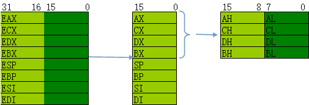
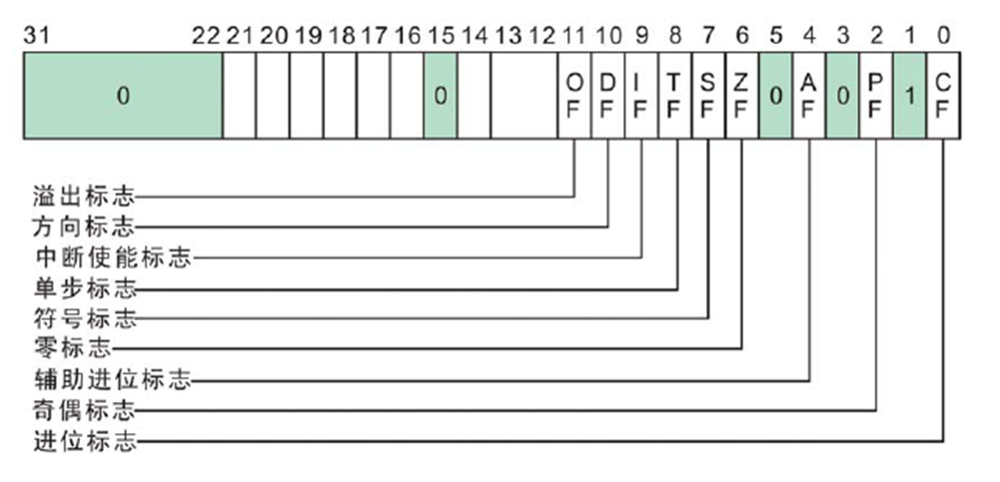
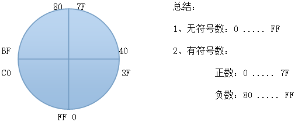
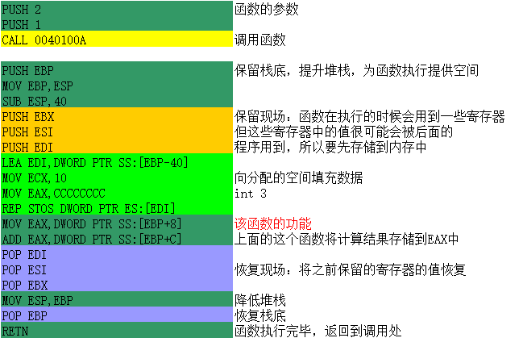

海哥逆向学习笔记记录

<!--more-->

# 工具软件下载

调试

- [x64dbg](https://github.com/x64dbg/x64dbg)


# 基础

## 寄存器

[图文详解通俗易懂的汇编语言寄存器_汇编语言_脚本之家](https://www.jb51.net/article/230062.htm)

[32位CPU寄存器常用知识汇总_ronnie88597的博客-CSDN博客_32位寄存器有哪些](https://blog.csdn.net/weixin_46222091/article/details/109205298)



### 通用寄存器

`AX(Accumulator Register)` ： 累加寄存器，它主要用于输入/输出和大规模的指令运算

- EAX 经常用于作为返回值

`CX(Count Register)`：计数寄存器，CX 寄存器在迭代的操作中会循环计数

`DX(data Register)`：数据寄存器，它也用于输入/输出操作。它还与 AX 寄存器以及 DX 一起使用，用于涉及大数值的乘法和除法运

`BX(Base Register)`：基址寄存器，用来存储基础访问地址

算

除了上面 AX、BX、CX、DX 寄存器以外，其他寄存器均不可以分为两个独立的 8 位寄存器

### 索引寄存器

索引寄存器主要包含段地址的偏移量，索引寄存器主要分为

`BP(Base Pointer)`：基础指针，它是栈寄存器上的偏移量，用来定位栈上变量，**栈底**

`SP(Stack Pointer)`: 栈指针，它是栈寄存器上的偏移量，用来定位**栈顶**

`SI(Source Index)`: 变址寄存器，用来拷贝源字符串

`DI(Destination Index)`: 目标变址寄存器，用来复制到目标字符串


### 控制寄存器

就剩下两种寄存器还没聊了，这两种寄存器是指令指针寄存器和标志寄存器：

`IP(Instruction Pointer)`： 指令指针寄存器，它是从 Code Segment 代码寄存器处的偏移来存储执行的下一条指令


### 标志寄存器



1. **CF** (Carry  Flag) 进位标志：如果运算结果的**最高位**（先确定数据宽度）产生了一个进位或借位，那么，其值为1，否则其值为0。无符号运算时关注
   1. 只影响CF的值：`mov al, 0xFE | add al, 0x10`

2. **PF** (Parity  Flag) 奇偶标志：奇偶标志PF用于反映运算结果中(**最低有效字节**，最低八位)“1”的个数为奇数个PF为0，偶数个为1
   1. `mov eax, 0x0  |  add eax, 0x3`

3. **AF** (Auxiliary  Carry Flag) 辅助进位标志：在发生下列情况时，辅助进位标志AF的值被置为1，否则其值为0：
   1. 在字操作时，发生低字节向高字节进位或借位时 ；FF**F**F
   2. 在字节操作时，发生低4位向高4位进位或借位时。F**F**
   3. FFFF**F**FFF，看加粗位置最高位是否为1
   4. `mov al, 0x49  |  add al, 0x8`
4. **ZF** (Zero  Flag) 零标志：零标志ZF用来反映运算结果是否为0。（mov指令不是运算）
5. **SF**(Sign  Flag) 符号标志：符号标志SF用来反映运算结果的符号位，它与运算结果的最高位相同。
   1. 负数,SF=1,正数SF=0
   2. `mov al, 0xF3  |  sub al, 0x1`

6. **OF**(Overflow  Flag) 溢出标志：溢出标志OF用于反映**有符号**数加减运算所得结果是否溢出。
   1. 
   2. 正 + 正 = 正（无溢出），如果结果是负数，则说明有溢出
   3. 负 + 负 = 负（无溢出），如果结果是正数，则说明有溢出
   4. 正 + 负 永远都不会有溢出
   5. CPU判断OF，首先看符号位是(1)否(0)有进位，再看最高有效数值位(符号位低一位)是(1)否(0)有向符号位产生进位，然后求xor。例：`0xC0+0x40，1 xor 0 = 1 , OF=1` 
   6. `mov al,0x80   | sub al,0x10 `
7. **DF** (Direction Flag) 方向标志：决定ESI，EDI的移动方向。0为加，1为减，加减量为字节数


## 内存

常用计量单位

**BYTE**(字节) = 8位(BIT)  `0XFF`

**WORD**(字) = 16位(BIT) `0XFFFF`

**DWORD**(双字) = 32位(BIT) `0XFFFFFFFF`

每个内存单元的宽度为8位，[编号]称为地址(加上中括号)

### 寻址公式

- [立即数]
- [reg] reg代表寄存器
- [reg+立即数]
- [reg+reg*(1,2,4,8)]
- [reg+reg*(1,2,4,8)+立即数]

​	

## 堆栈

Windows分配栈时：栈底高地址，栈头低地址

### 堆栈汇编指令

- **PUSH** 入栈
  - push立即数(32位)，栈顶-4
  - push寄存器16位(栈顶-2)，32位，不允许8位
  - push内存，同样不允许8位
- **POP** 出栈
  - 栈顶+4或+2
  - 同push规则，不允许8位
- PUSHAD
  - 把8个通用寄存器的值保存到堆栈，然后就可以随意使用寄存器（保存现场）
- POPAD
  - 恢复8个寄存器的值


### Windows堆栈

1. 先进后出
2. 向低地址扩展

函数调用前后堆栈需要平衡


## 汇编指令

- **MOV** 目标操作数，源操作数。作用：拷贝源操作数到目标操作数

  - 从指定内存中写入/读取数据
    - `mov dword ptr ds:[0x0012FF34],0x12345678`
      - dword ：要读/写多少 此时是4字节  byte == 1字节 word == 2字节 dword == 4字节
      - ptr: Point 代表后面是一个指针  (指针的意思就是里面存的不是普通的值，而是个地址)
      - ds：段寄存器 先不用管 记住就行
- **LEA** 获取内存地址
  - 例如想获取一个内存地址，其实无法使用 `mov eax,eax-4` 这种写法
  - 可以写成 `lea eax,dword ptr ds:[eax-4]`
  - 等同于 `sub eax,4`
- **XCHG** 交换数据 `XCHG R/M,R/M/IMM`
- **MOVS** 移动指定内存地址的数据数据(内存,内存)，EDI和ESI受DF位影响
  - `MOVS BYTE PTR  ES:[EDI],BYTE PTR DS:[ESI] `简写为：`MOVSB`
  - `MOVS WORD PTR  ES:[EDI],WORD PTR DS:[ESI]`简写为：`MOVSW`
  - `MOVS DWORD PTR  ES:[EDI],DWORD PTR DS:[ESI]`简写为：`MOVSD`
- **STOS** 将`Al/AX/EAX`的值存储到[EDI]指定的内存单元，根据宽度决定存多少，EDI受DF位影响
  - `STOS BYTE PTR  ES:[EDI]`简写为`STOSB`
  - `STOS WORD PTR  ES:[EDI]`简写为`STOSW`
  - `STOS DWORD PTR  ES:[EDI]`简写为`STOSD`
- **REP** 按计数寄存器 (ECX)  中指定的次数重复执行字符串指令(ECX会自己-1)
  - 例 `REP MOVSD` ,`REP STOSD`
- **JMP** 只修改EIP的值`JMP reg/imm`，地址小于128字节会自动加上short
- **CALL** 修改EIP的值，并把下一行指令的地址压入栈`CALL reg/imm`
- **RET**  从栈中取出地址，并且修改EIP的值`POP EIP`
- **RETN** ret的同时平衡堆栈，可以用来判断函数的参数个数 `POP EIP   add esp, n`
- **CMP**  （实际是SUB，但是只改标志寄存器的值），参数不能同时为内存`CMP R/M,R/M/IMM`
  - 比较两个操作数是否相等，看ZF位是否位0
  - 两个数大小，看SF位

- **TEST** 两个数值进行与操作，结果不保存，会改变相应标志位`TEST R/M,R/M/IMM`
  - `TEST eax,eax` 判断某寄存器是否为0，根据ZF位是否为1


### JCC指令

| JCC指令     | 中文含义                                           | 英文原意                                                | 检查符号位       | 典型C应用                  |
| :---------- | :------------------------------------------------- | :------------------------------------------------------ | :--------------- | :------------------------- |
| JZ/JE       | 若为0则跳转；若相等则跳转                          | jump if zero;jump if equal                              | ZF=1             | `if (i == j);if (i == 0);` |
| JNZ/JNE     | 若不为0则跳转；若不相等则跳转                      | jump if not zero;jump if not equal                      | ZF=0             | `if (i != j);if (i != 0);` |
| JS          | 若为负则跳转                                       | jump if sign                                            | SF=1             | `if (i < 0);`              |
| JNS         | 若为正则跳转                                       | jump if not sign                                        | SF=0             | `if (i > 0);`              |
| JP/JPE      | 若1出现次数为偶数则跳转                            | jump if Parity (Even)                                   | PF=1             | (null)                     |
| JNP/JPO     | 若1出现次数为奇数则跳转                            | jump if not parity (odd)                                | PF=0             | (null)                     |
| JO          | 若溢出则跳转                                       | jump if overflow                                        | OF=1             | (null)                     |
| JNO         | 若无溢出则跳转                                     | jump if not overflow                                    | OF=0             | (null)                     |
| JC/JB/JNAE  | 若进位则跳转；若低于则跳转；若不高于等于则跳转     | jump if carry;jump if below;jump if not above equal     | CF=1             | `if (i < j);`              |
| JNC/JNB/JAE | 若无进位则跳转；若不低于则跳转；若高于等于则跳转； | jump if not carry;jump if not below;jump if above equal | CF=0             | `if (i >= j);`             |
| JBE/JNA     | 若低于等于则跳转；若不高于则跳转                   | jump if below equal;jump if not above                   | ZF=1或CF=1       | `if (i <= j);`             |
| JNBE/JA     | 若不低于等于则跳转；若高于则跳转                   | jump if not below equal;jump if above                   | ZF=0或CF=0       | `if (i > j);`              |
| JL/JNGE     | 若小于则跳转；若不大于等于则跳转                   | jump if less;jump if not greater equal                  | SF != OF         | `if (si < sj);`            |
| JNL/JGE     | 若不小于则跳转；若大于等于则跳转；                 | jump if not less;jump if greater equal                  | SF = OF          | `if (si >= sj);`           |
| JLE/JNG     | 若小于等于则跳转；若不大于则跳转                   | jump if less equal;jump if not greater                  | SF != OF 或 ZF=1 | `if (si <= sj);`           |
| JNLE/JG     | 若不小于等于则跳转；若大于则跳转                   | jump if not less equal;jump if greater                  | SF=0F 且 ZF=0    | `if(si>sj)`                |


### 运算指令

- **ADD** 加

- **SUB** 减

- **AND** 与

- **OR** 或

- **XOR**  异或，经常用于eax清零(`xor eax,eax`)，影响ZF标志位
  - 源操作数可以是立即数、通用寄存器、段寄存器、或者内存单元
  - 目标操作数可以是通用寄存器、段寄存器或者内存单元
  - 操作数的**宽度**必须一样
  - 源操作数和目标操作数不能同时为内存单元

- **NOT** 非 只有一个操作数

- **ADC** 带进位加法，额外加上CF标志位的值

- **SBB** 带借位减法


### 汇编中的函数(debug版)

debug版call最后可能有一个检查堆栈是否平衡的call：

- `add esp xx`，使esp和ebp在同一个地址
- `cmp  ebp,esp` 判断ebp和esp是否相等
- `call __RTC_CheckEsp (xxxxxxxx)` 进入一个检查esp的call，出错会返回异常
- `mov esp,ebp ;  pop ebp`没问题的话拉下栈顶，恢复栈底





## C/C++

### 裸函数

普通函数编译器会为我们做很多事情，生成一些汇编语句

裸函数不生成任何汇编代码，以`int 3 (CC)` 填充

```c++
//定义了一个裸函数，返回值、函数名和参数可以任意
int __declspec(naked) Xxx(int x, int y)
{
	//在里面写汇编代码
	__asm
	{
		//保留调用前的栈底
		push ebp
		//提升堆栈
		mov ebp, esp
		sub esp, 0x40
		//保留现场
		push ebx
		push esi
		push edi
		//开始填充缓冲区
		mov eax, 0xCCCCCCCC
		mov ecx, 0x10
		lea edi, dword ptr  ds : [ebp - 0x40]
		rep stosd
		//函数的核心功能
		mov eax, dword ptr ds : [ebp + 0x8]
		add eax, dword ptr ds : [ebp + 0xc]
		//恢复现场
		pop edi
		pop esi
		pop ebx
		//降低堆栈
		mov esp, ebp
		pop ebp
		//自己写ret
		ret
	}
}
```


### 调用约定

加在方法名前：`int __cdecl Plus(int a, int b)`

| 调用约定                     | 参数压栈顺序                         | 平衡堆栈                          |
| ---------------------------- | ------------------------------------ | --------------------------------- |
| __cdecl（默认）              | 从右至左入栈                         | 调用者清理栈（外平栈）            |
| __stdcall（Win32API）        | 从右至左入栈                         | 自身清理堆栈（内平栈）            |
| __fastcall（寄存器比内存快） | ECX/EDX传送前两个，剩下 从右至左入栈 | 自身清理堆栈（2个参数内不用平栈） |


### 找程序的入口

控制台程序 main 函数被调用前要先调用的函数如下：`GetVersion() `,`_heap_init() `,`GetCommandLineA() `,`_crtGetEnvironmentStringsA() `,`_setargv()`,`_setenvp()`,`_cinit()` 这些都是控制台程序需要初始化用的。

若看出上面的某一个(反汇编窗口可能智能显示出以上方法名)，在它后面找有三个参数的call，那个就是入口


## X64DBG

导出修改过的文件，菜单 文件-补丁(`ctrl+P` )，再点击修补文件

### 断点

- 左下方命令窗口输入 `bp MessageBoxA`
- 反汇编窗口选中一行按`F2`开关断点
- 断点窗口选中一行按空格 开关断点

在堆栈窗口选一行按Enter，可以在反汇编中转到指定Dword，一般栈顶保存到是函数的返回地址。

选项-选项-取消勾选系统断点-选中入口断点：这样和画堆栈图时配置一样。

### 快捷键

跳转到某地址：`Ctrl+G` 反汇编窗口

F7步入CALL后，连续很多JMP，按回车直接跳转到最后地址，在按F8过来

Enter进函数，减号出函数


## Visual Studio 2022


### 内存与寄存器窗口：

Visual Studio 提供了几个窗口，可用于查看局部变量、全局变量、寄存器和任意内存缓冲区。 若要打开以下任何窗口，请从 "**调试**" 菜单中选择 " **Windows**"。

- 局部变量
- 自动
- 寄存器
- 观看
- 内存
  - 若要启用“内存”窗口，必须在“工具”>“选项”（或“调试”>“选项”）>“调试”>“常规”中选择“启用地址级调试”。
  - 内存窗口的地址搜索栏之中使用`&变量名`转到对应变量的内存地址
  - 内存窗口的地址搜索栏之中输入方法名即可跳转到方法内存地址，或者选中方法名拖进内存窗口


### 反汇编窗口

在调试程序时，右键源代码选择**转到反汇编**,在反汇编窗口右键可以设置需要显示的数据


### 调用堆栈窗口

- 打开反汇编窗口，双击堆栈窗口内一条，可以跳转到相应位置
- 右键可以设置**显示外部代码**，可以找到调用main方法的地方
